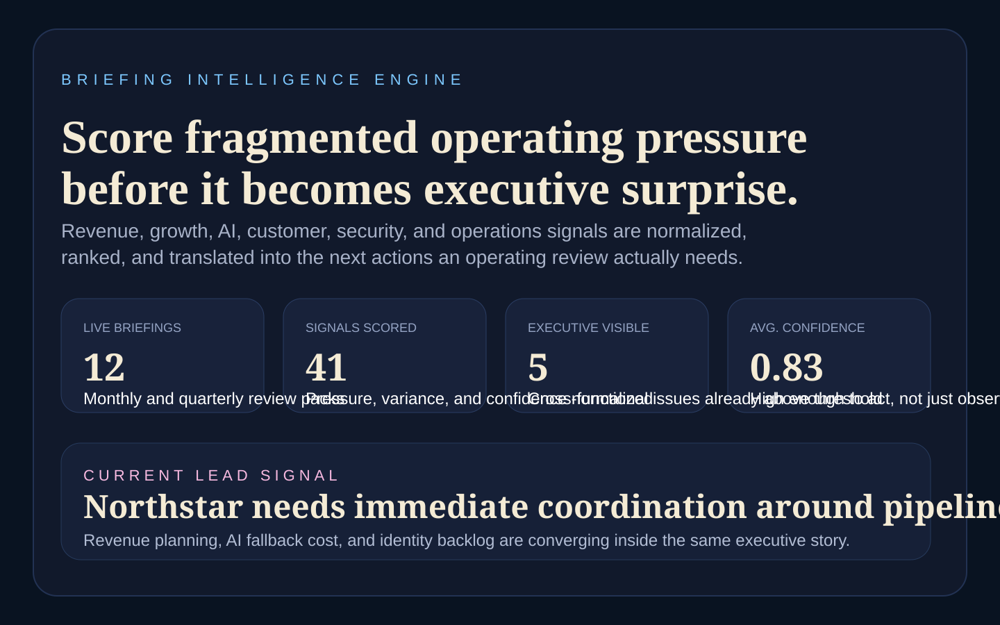
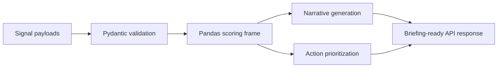
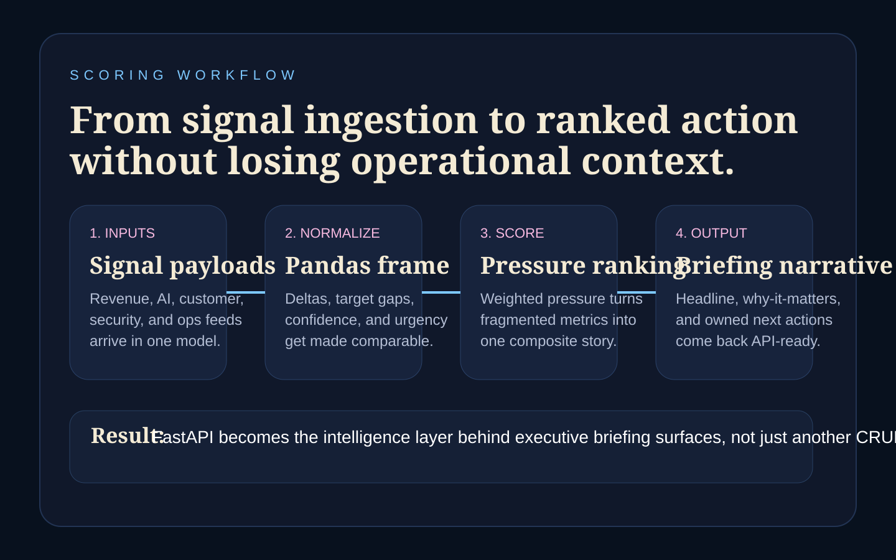
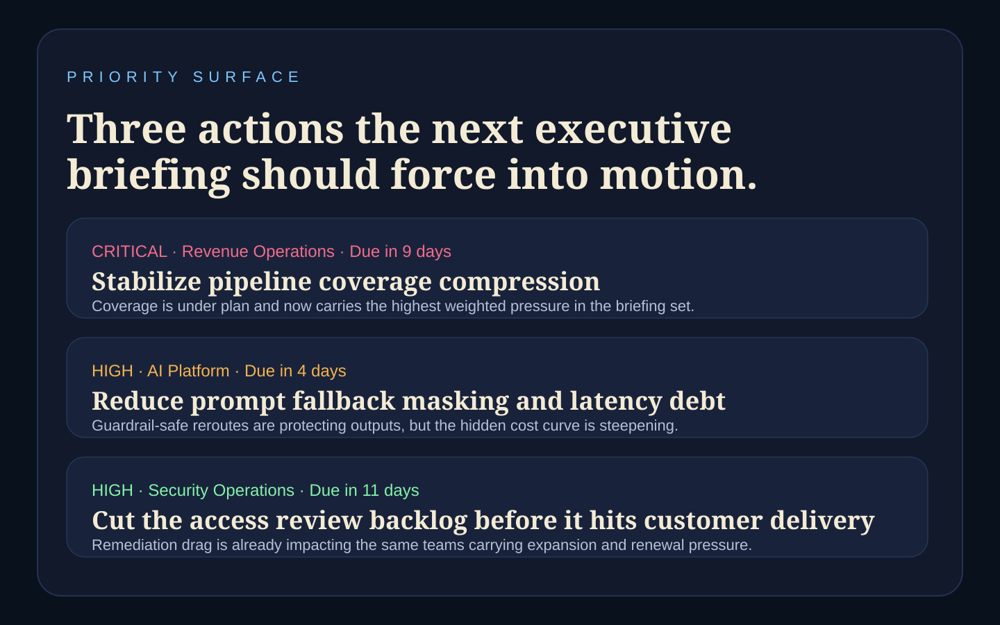
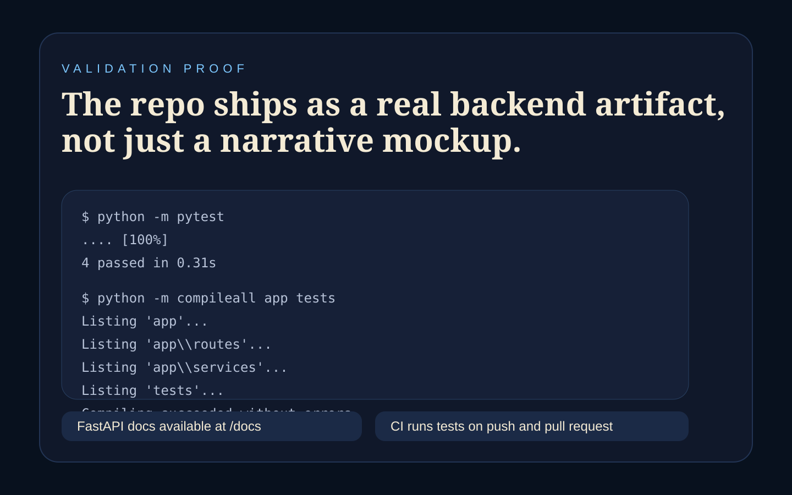

# Briefing Intelligence Engine



## Executive Summary

Briefing Intelligence Engine is a recruiter-ready Python + FastAPI backend that
turns fragmented operating signals into executive briefing outputs. It ingests
revenue, growth, security, AI, customer, and operations inputs, scores them with
Pandas-backed logic, then emits narrative summaries and prioritized next actions.

## Recruiter Takeaway

This project is designed to show:

- Python backend depth beyond TypeScript-heavy portfolio work
- FastAPI and Pydantic modeling for production-style API design
- Pandas-backed scoring and prioritization logic
- how executive reporting systems can be engineered, not just mocked up

## Tech Stack

[](https://www.python.org/)
[](https://fastapi.tiangolo.com/)
[](https://docs.pydantic.dev/)
[](https://pandas.pydata.org/)
[](https://docs.pytest.org/)
[](https://opensource.org/license/mit)

## Overview

| Area | What it shows |
| --- | --- |
| Signal modeling | Executive briefing inputs across revenue, growth, AI, security, ops, and customer domains |
| Scoring engine | Pandas-backed pressure, urgency, and gap-to-target calculation |
| Narrative outputs | Executive summary, shifts to watch, opportunity framing, risk framing |
| Action sequencing | Priority-ranked operational next steps with ownership and due dates |
| API surface | FastAPI routes with automatic OpenAPI docs at `/docs` |

## Architecture



## Executive Briefing Workflow

1. A client sends a structured briefing payload with multi-domain signals.
2. FastAPI validates the request through Pydantic.
3. The engine normalizes signals into a Pandas DataFrame.
4. Weighted pressure, target gaps, and confidence produce a composite score.
5. The service returns a status, headline, why-it-matters points, and next actions.

## Sample Request

```json
{
  "briefing_id": "briefing-demo-q2",
  "account_name": "Northstar Holdings",
  "audience": "executive",
  "time_horizon": "monthly",
  "signals": [
    {
      "signal_id": "rev-pipeline-01",
      "domain": "revenue",
      "title": "Pipeline coverage compression",
      "metric": "coverage",
      "current_value": 2.1,
      "previous_value": 2.8,
      "target_value": 3.0,
      "impact_weight": 0.92,
      "confidence": 0.86,
      "owner": "Revenue Operations",
      "due_in_days": 9,
      "note": "Enterprise segment slipped below planning guardrail."
    }
  ]
}
```

## Sample Response

```json
{
  "status": "needs-attention",
  "score": 62,
  "headline": "Northstar Holdings is still recoverable, but pipeline coverage compression should lead the next operating review.",
  "why_it_matters": [
    "Pipeline coverage compression is off target by 0.9 on coverage."
  ],
  "recommended_next_actions": [
    {
      "title": "Stabilize pipeline coverage compression",
      "owner": "Revenue Operations",
      "priority": "high",
      "due_in_days": 9,
      "rationale": "High weighted pressure driven by coverage, confidence 86%, and deadline pressure."
    }
  ]
}
```

## Screenshots

### Hero


### Scoring Workflow



### Priority Surface



### Validation Proof



## Setup

```powershell
Set-Location "C:\Users\chaus\dev\repos\briefing-intelligence-engine"
py -3.11 -m venv .venv
.venv\Scripts\Activate.ps1
python -m pip install -e .[dev]
uvicorn app.main:app --reload
```

Open:

- API docs: [http://127.0.0.1:8000/docs](http://127.0.0.1:8000/docs)

## Validation

```powershell
Set-Location "C:\Users\chaus\dev\repos\briefing-intelligence-engine"
python -m pytest
python -m compileall app tests
```

## Portfolio Links

- [Kinetic Gain](https://kineticgain.com/)
- [LinkedIn](https://www.linkedin.com/in/mirzacausevic)
- [Skills / Portfolio](https://mizcausevic.com/skills/)
- [Medium](https://medium.com/@mizcausevic)
- [GitHub](https://github.com/mizcausevic-dev)
