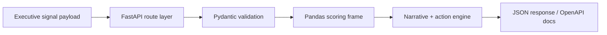

# Architecture

## Overview

Briefing Intelligence Engine is the Python backend counterpart to executive-facing
presentation surfaces. It ingests structured operating signals, normalizes them
into a tabular model, scores pressure and urgency with Pandas, and emits
briefing-ready outputs for narrative and decision support.

## Request Flow

## Core Components

- `app/models.py`
  Defines the briefing, signal, summary, narrative, and priority action models.
- `app/services/briefing_engine.py`
  Converts signals into a Pandas DataFrame, calculates urgency and pressure, and
  produces summary outputs.
- `app/routes/briefings.py`
  Exposes list, detail, analysis, narrative, and dashboard endpoints.
- `app/sample_data.py`
  Provides realistic demo payloads for recruiter-facing demos and tests.

## Scoring Logic

- urgency increases as deadlines approach
- confidence softens or amplifies pressure
- target gaps and weighted impact combine into a composite score
- the resulting score maps to:
  - `stable`
  - `needs-attention`
  - `executive-visible`

## Why This Matters

This project is designed to show not just API construction, but how backend
systems can translate multi-domain operating data into executive-ready decisions.

